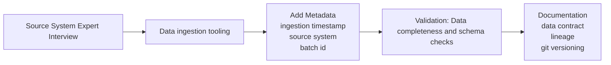

## 🥉 Bronze Layer Design

The bronze layer represents **raw, unprocessed data ingested directly from source systems**. Its purpose is to preserve data exactly as received, ensuring traceability and replayability.

---

### 🔍 1. Source Understanding
Before ingestion, the source system is reviewed with domain experts to understand:
- Data origin and meaning
- Update patterns (batch, streaming, API)
- Known data quality issues
- Schema structure and expected changes

---

### 🔌 2. Ingestion Strategy
Data is ingested using an appropriate method depending on the source:
- Batch (scheduled jobs, ETL tools)
- Streaming (event-driven pipelines)
- API/file-based ingestion

Tooling is selected based on latency, volume, and complexity requirements.

---

### 🥉 3. Bronze Layer Principles
- Stores raw data with no transformations
- Preserves original schema as-is
- Adds metadata (ingestion timestamp, source system, batch ID)
- Enables full data replay

---

### 🔍 4. Data Quality Checks
Light validation is applied:
- Row count completeness checks
- Schema consistency monitoring
- Duplicate or missing batch detection

No data corrections are performed at this stage.

---

### 📚 5. Documentation
Each dataset includes:
- Source system description
- Field-level metadata
- Ingestion frequency and method
- Data lineage references

